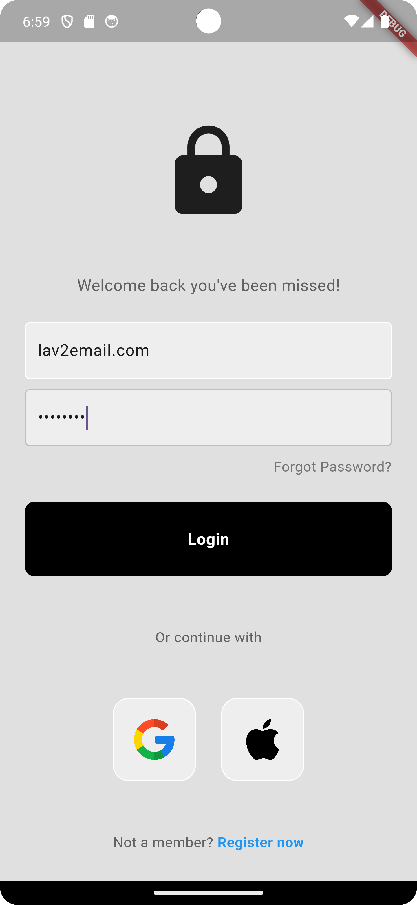
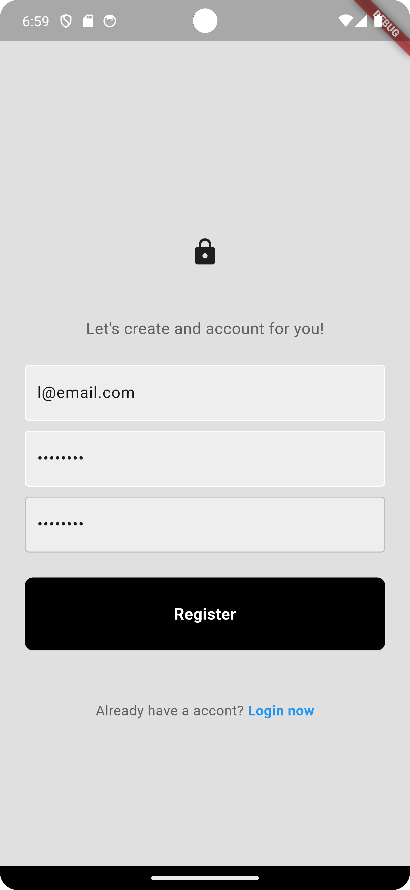

# Flutter Firebase Authentication Project

Este projeto é um aplicativo Flutter que integra Autenticação Firebase para login de usuários, registro e Login com Google. Ele fornece uma interface simplificada para os usuários autenticarem com e-mail e senha ou usando sua conta do Google.

## Tabela de Conteúdos

- [Recursos](#recursos)
- [Página de Login](#página-de-login)
- [Página de Registro](#página-de-registro)
- [Página Inicial](#página-inicial)
- [Pré-requisitos](#pré-requisitos)
- [Instalação](#instalação)


## Recursos

- Login de usuário com e-mail e senha
- Registro de usuário com e-mail e senha
- Integração do Login com Google
- Gerenciamento do estado de autenticação do Firebase
- Interface simples e intuitiva


## Página de Login

A classe `LoginPage` fornece a UI para o login do usuário.




## Página de Registro

A classe RegisterPage fornece a UI para o registro do usuário.




## Página Inicial

A classe HomePage exibe o e-mail do usuário se estiver logado e fornece um botão de saída.


## Pré-requisitos

Antes de começar, certifique-se de que atendeu aos seguintes requisitos:

- Você instalou o [Flutter](https://flutter.dev/docs/get-started/install).
- Você tem uma conta do Google para configuração do Firebase.
- Você tem um projeto Firebase com os seguintes serviços habilitados:
    - Autenticação Firebase e permitido o Login com Google e com email e senha.

## Instalação

1. Clone o repositório:

    ```bash
    git clone https://github.com/yourusername/your-repo-name.git
    cd your-repo-name
    ```

2. Instale as dependências:

    ```bash
    flutter pub get
    ```

3. Configure o Firebase para o seu aplicativo Flutter:

    - Acesse o [Console Firebase](https://console.firebase.google.com/).
    - Crie um novo projeto (ou use um existente).
    - Siga as intruções para adicionar o Firebase ao seu aplicativo Flutter desse [site](https://firebase.flutter.dev/docs/overview/)

4. Execute o aplicativo:

    ```bash
    flutter run
    ```
